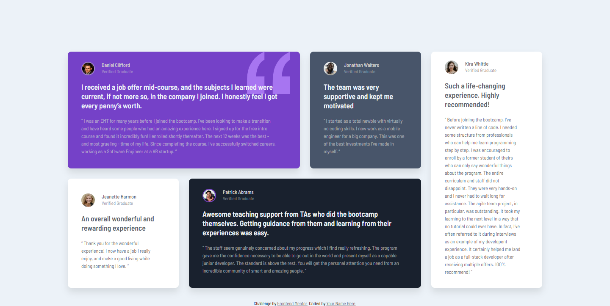
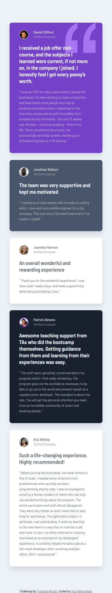

# Frontend Mentor - Testimonials grid section solution

This is a solution to the [Testimonials grid section challenge on Frontend Mentor](https://www.frontendmentor.io/challenges/testimonials-grid-section-Nnw6J7Un7). Frontend Mentor challenges help you improve your coding skills by building realistic projects.

## Table of contents

- [Overview](#overview)
  - [The challenge](#the-challenge)
  - [Screenshot](#screenshot)
  - [Links](#links)
- [My process](#my-process)
  - [Built with](#built-with)
  - [What I learned](#what-i-learned)
  - [Continued development](#continued-development)
  - [Useful resources](#useful-resources)
- [Author](#author)

## Overview

### The challenge

Users should be able to:

- View the optimal layout for the site depending on their device's screen size

### Screenshots

### Links

- Solution URL: [Frontendmentor](https://www.frontendmentor.io/solutions/responsive-testimonials-using-css-grid---mobile-first-approach-rLGiTXSKdg)
- Live Site URL: [Netlify](https://testimonials-grid-sections-main.netlify.app/)

## My process

### Built with

- Semantic HTML5 markup
- CSS custom properties
- Flexbox
- CSS Grid
- Mobile-first workflow

### What I learned

I learned making a different layout having all the sections with different sizes using Grid. And, also implemented Mobile-first approach.

### Continued development

I'll continue to master Grid layouts and focuse on clean code.

### Useful resources

- [Resource](https://www.joshwcomeau.com/css/interactive-guide-to-grid/) - This is an amazing article which helped me finally understand Grids. I'd recommend it to anyone still learning this concept.

## Author

- Linkedin - [Aliza Ikram](https://www.linkedin.com/in/aliza-ikram/)
- Frontend Mentor - [@AlizaIkram](https://www.frontendmentor.io/profile/AlizaIkram)
